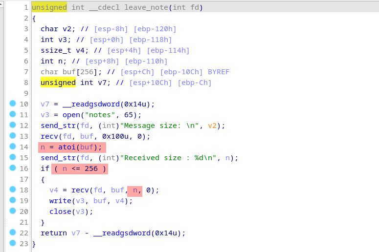

# Insecure Shell

> pwn/exploit

A custom shell is running on port 4444 on the server. This custom shell authentify the user (with the root password) and jump to a restricted shell if it's not.

Modern protections are enabled : 

## Getting the source code

Since the challenge description doesn't give any files I've begun to think that it was a Black-box pwn challenge (very scary °_°).

But after being connected to the shell, I could cat files of the working directory and retrieve the sources, the binary and other environments files (dockerfile, sshd conf).

## Looking for vulnerabilities

The program consist of a server listening on port 4444, fork when a client connect and authent the user.

As I don't know the password, I can't connect as root to get a priviledged shell, and staying stucked in the restricted one. 

The guest shell allow the user to play with 5 commands :
1. cat
1. ls
1. leave_note
1. exit
1. whoami

The **leave_note** seems to be interesting because it let the user to write a file on the disk. At the moment, I was thinking about this function as very interesting because it's a point of interaction and the function necessarily use a some buffering to get the user input.

And after looking at the code, this function got an integer overflow that allow us to overflow the buffer !

Well that's great but the program as been compile with canary protection. Even if we can overflow, the function will crash beforce returning.

To bypass canary we can use the fact, that the process fork when a client connect. A forked process is just a copy of the parent and contain the same value for the canary. We can use that to bruteforce the canary, bytes by bytes.

See **solve.py**.

Now we can overflow and (re)set the canary to avoid crash. 

> I didn't have the time to finish and flag this chall, but maybe I will continue one day because it's a very interesting one !

