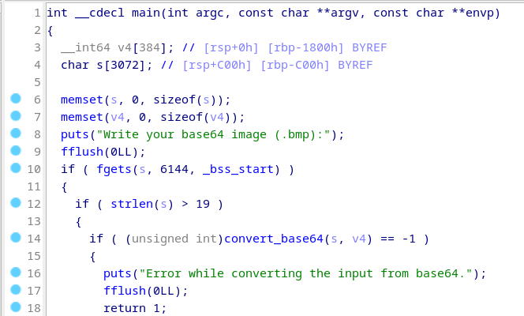
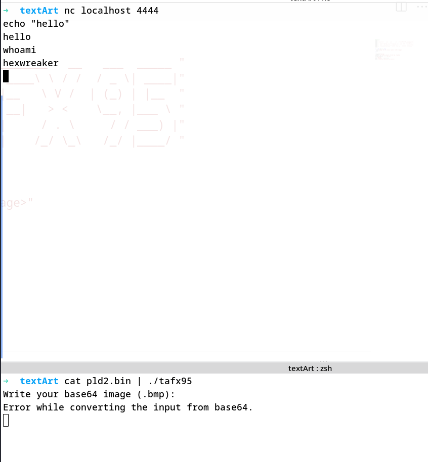

# Slidding in the 90s 

> pwn/exploit (easy)


This challenge was available during the **Battle Royal** (wednesday at 13:30). It consist of a service that convert a bitmap image into an ASCII one of size 22x22.

This service run on the server "192.168.2.121" on port 2222. The goal is to exploit the service to read the flag in «/root/flag.txt», on the server.

There is a «light-client» here :
```
#/bin/sh
echo "  _______        _                 _     ________   __   ___  _____ "
echo " |__   __|      | |     /\        | |   |  ____\ \ / /  / _ \| ____|"
echo "    | | _____  _| |_   /  \   _ __| |_  | |__   \ V /  | (_) | |__  "
echo "    | |/ _ \ \/ / __| / /\ \ | '__| __| |  __|   > <    \__, |___ \ "
echo "    | |  __/>  <| |_ / ____ \| |  | |_  | |     / . \     / / ___) |"
echo "    |_|\___/_/\_\\__/_/    \_\_|   \__| |_|    /_/ \_\   /_/ |____/ "
echo ""

if [ $# -ne 2 ]; then
  echo "Usage: $0 <IP serveur TextArt FX 95> <image>"
  exit 1
fi

res_path="tmp.bmp"
convert "$2" -resize 22x22^ -format bmp .tmp.bmp
output=$(base64 -w 0 .tmp.bmp)
rm .tmp.bmp
echo "$output" | nc $1 2222
echo "Conversion terminée avec succès."
```

Also, there is a «heavy-client», it's just the binary behind the web service running on port 2222 of the server.

## Looking for vulnerabilities

I started to understand how to interact with the binary and to identify the entry points.
The program expect an ASCII string as input.



The bug is a common buffer-overflow and we can pass more bytes than the buffer can contain (3072)

## Exploit

The exploit should be easy, because there are no protection at all : stack is RWX, no ASLR, no Canary.

Well, I used gdb to verify that I could overwrite the return RIP of the stack frame and it works. 

Then, I just get a shellcode from « https://shell-storm.org/shellcode/index.html », for Linux x86_64. (I choose the shell on socket 4444)

The payload is build in the **solve.py** file and is composed of : 
1. nopsled (0xB00)
1. shellcode
1. padding
1. the buffer address (overwrite return rip)

The address of the buffer can be retrieve with gdb. The nopsled is long enough to bypass some stack address inconsistencies  between different environments (i.e. debug/real).

And it works !




## Ze problem 

In fact, I didn't flag this chall during the CTF **:(**
I success on my machine but not on the server, and the reason is that the creator hardcoded the base address from what he find on his machine (ubuntu distro). 

The address that I find on my Debian was not the same than his ubuntu and I couldn't guess that in the partial time (20 min). 

It has been flagged by only ONE team ! Surely that lucky guy was on Ubuntu... 

# -

Micro-merlin© said one day : « Reverse is life »


