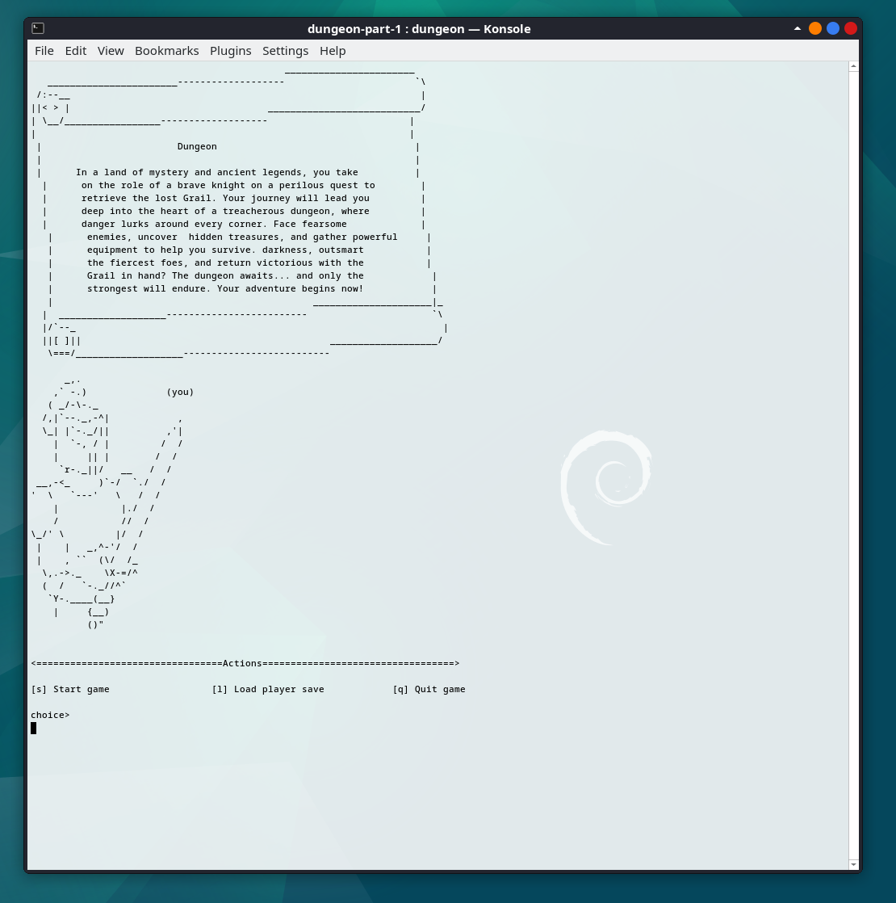
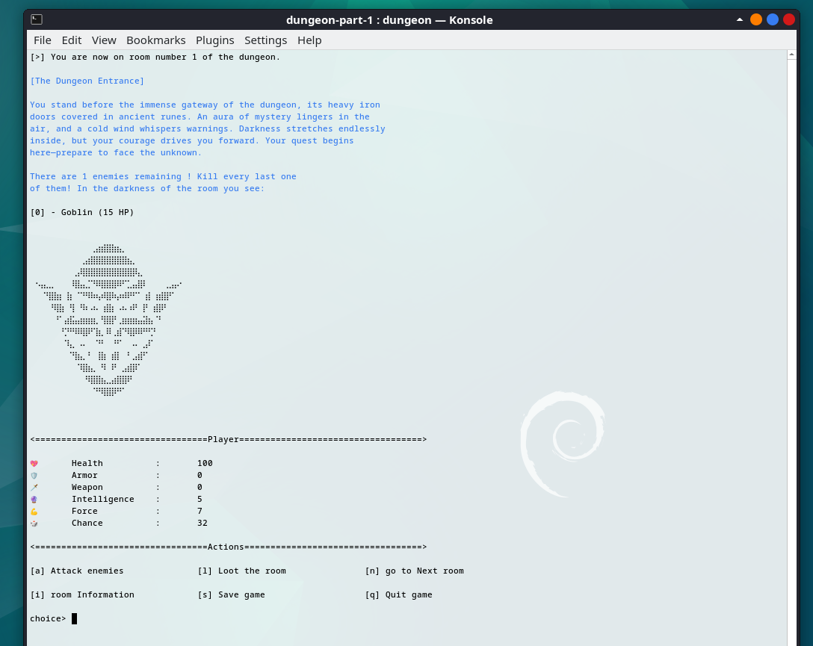
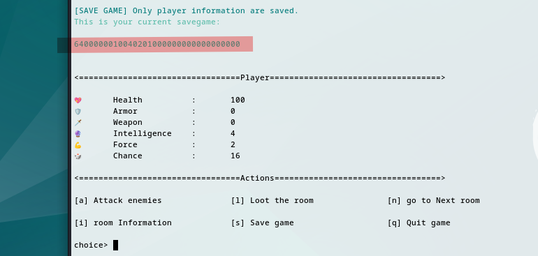
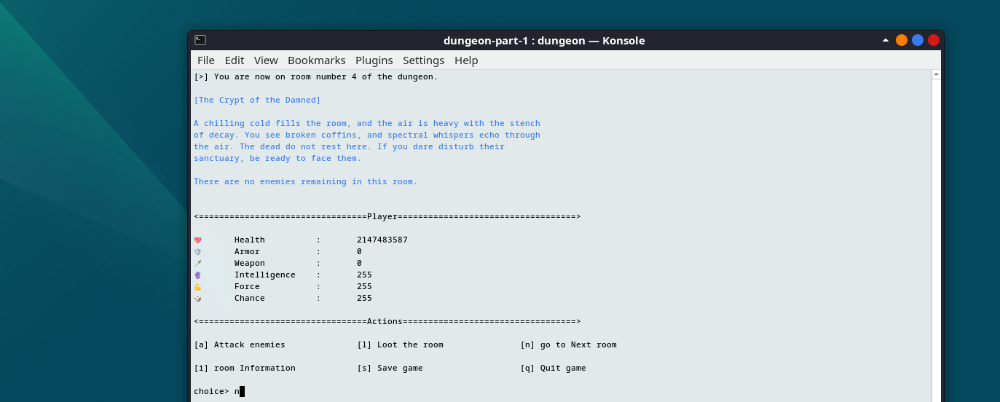
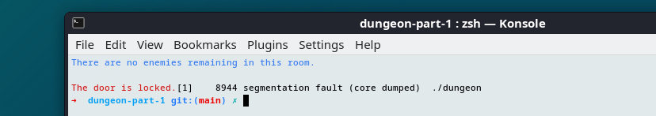
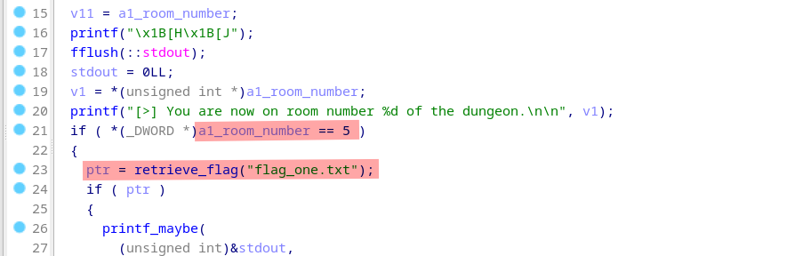
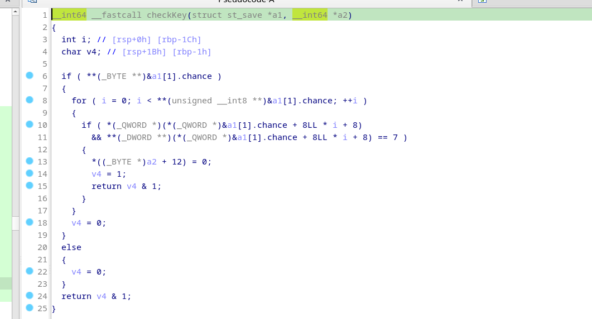
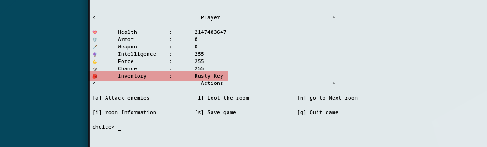
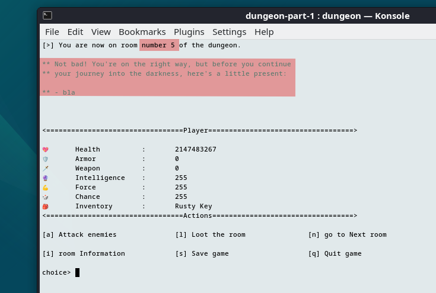

# Dungeon : part 1

> reverse

## Presentation

It's a remote CLI game where we can have fun killing some orcs.



We can start a new game or load a player save. 

Let's play !

Six actions are available :

1. Attack enemies : depending on the force of the character, we hit enemies but we get hit too.
2. Room infos : (explicit)
2. Loot the room : look for items in the chest of the room and add to inventory.
2. Save the game : generate a hex string representing player datas.
2. Next room  : only if all mobs are dead
2. Quit  : (explicit)



At the room 3 and with the default life (100 hp) we can't go further. The player doesn't have enough life and die.

So let's have a look on the code to find a different way to play.

## Reverse game saving functionality

The «save game» functionality can be use to control the player attributes (hp, force, chance, ...).

Here is datas of the saved player :



I analyze the save format by generating several saves based on room number, number of enemies and the player health. Diffing saves help me understand the format :  

```
| (4 bytes) | (1 byte) |   (1 byte)   | (1 byte) | (1 byte) | (left byte) |
|  health   |  chance  | intelligence |  force   |  x value |     ...     |
```

I can now forge a personalized save to have infinite life and power ! Even beeing Hulk, I'm stuck in front of the door of the room 5 ;(





And guess what, the condition to get the first flag is to reach the room 5.



Well, let's understand why the door is locked and how can it be unlocked.

There is a string in the code that say : 

```
"You have unlocked the door using a rusty key and can now exit the room.\n"
```

This is printed only if the **checkKey** function return 1. Here is the function code, after som reversing and re-create the player save structure in memory : 



It seems that if a value is set to one, then the program will search for a value equal to 7 in a vector. This is the player inventory and we can now add the "rusty key" to our custom save.

```
ffffff7fffffffff00000100000000000107000000ffffffffffffffffffffff
```






