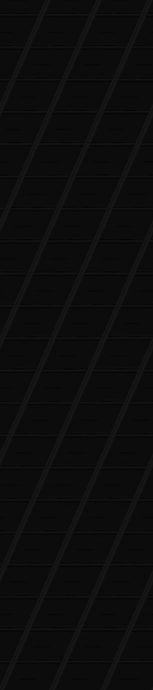

# Le calme avant la tempest

```
Une attaque TEMPEST consiste à acquérir les signaux parasites compromettants émis par un équipement, et à les remettre en forme afin de reconstruire le signal original.

Une interception d'un signal vidéo émis par un écran a pu être enregistrée et remise en forme par un logiciel de raster. La fréquence d'échantillonnage est de 20 MHz. Les données sont des entiers signés sur 16 bits. Reconstituez le signal vidéo pour voir apparaître le flag.
```

L'objectif est de lire le flag qui est affiché sur une des images de la vidéo. Les données sont un fichier contenant des entier 61 bits représentant les images en niveaux de gris. Pour lire le flag sur l'image il faut connaître la largeur de l'image afin de réassembler correctement chaque ligne de pixels.

# Stratégie 1 

Tout d'abord, j'ai essayé certaines résolutions courantes, mais ce n'était pas cela.
Ensuite j'ai essayé de recalculer la résolution des images en fonction de la fréquences d'échantillonage, du nombre d'échantillons, de la durée de la vidéo (fréq x échantillons) et de la fréquences de raffraichissement d'un écran classique (60 Hz soit 60 images par secondes) Cette méthode n'a pas fonctionné.

# Stratégie 2 : bruteforce

J'ai écris un script qui construit une image à partir des données et pour toutes les largeurs possibles (jusqu'à 2000 pour commencer).
cela fait beaucoup d'image à vérifier mais cela fonctinne puisque la largeur où l'on voit un texte appraître est 1780.




