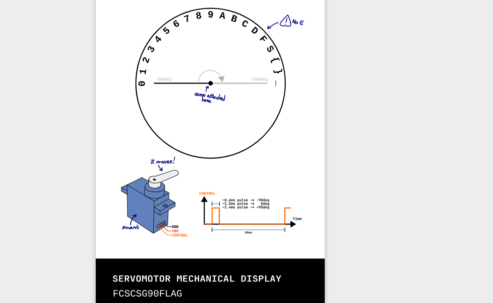

# Mechanical display

Cette horloge permet de pointer vers certains caractères : 



Nous avons un fichier contenant une liste de fronts montants (1) et descendants (0) ainsi que leur temps.

```
#0  0!
#5290  1!
#5489  0!
#7290  1!
#7489  0!
#9291  1!
```

À partir de ce fichier il est possible de reconstruire le signal carré qui à été utilisé par l'horloge. 
Plus simplement, on peut reconstruire la liste des "durées" des bits à 1 pour construire une liste des angles qui ont été envoyé au servo-moteur.
Chaque angle correspond à un caractère.

Voir le script **solve.py** pour retrouver les caractères affichés par l'horloge.


