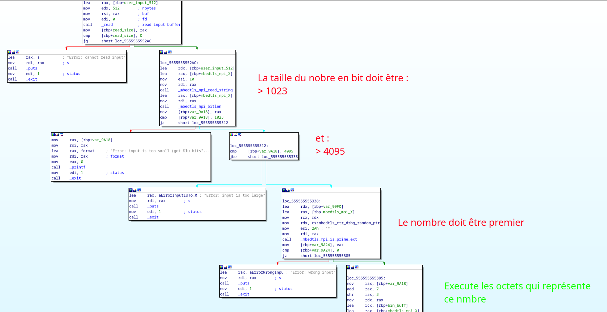

# Long Prime Shellcode

L'objectif est de trouver un nombre qui se représente avec au moins 1023 bit et au plus 4095 et qui soit premier. Si cela est la cas, la chaine d'octets qui représente le nombre est exécuté.

# Stratégie

Il faut trouver un nombre premier dont le prefix soit un shellcode qui appel execve.

Pour cela j'utilise le fichier **solve.py** pour compiler le shellcode dans le fichier **prefix.bin**.

Puis j'utilise le programme **solve.c** (compilé avec -O3 pour plus de rapidité !) qui recherche un nombre premier qui commence par le prefix.

