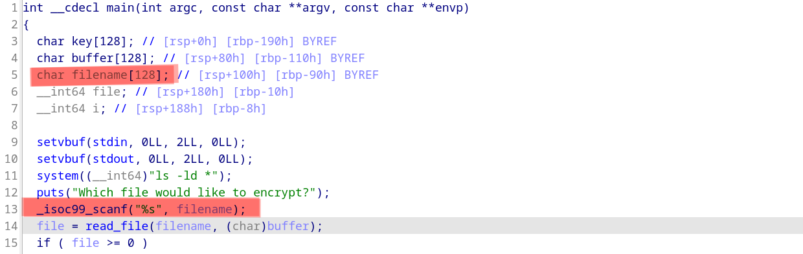

# Xortp

Un bon vieux binaire statique où il faut ropper !

## La vulnérabilité 

La vulnérabilité est un BO dans l'utilisation de la fonction **scanf**

## Exploitation

L'exploit est dans le fichier **solve.py**

