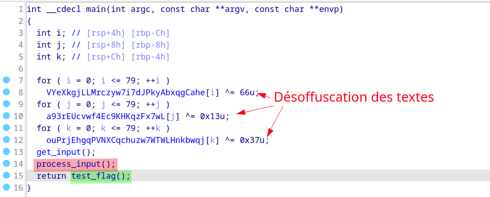
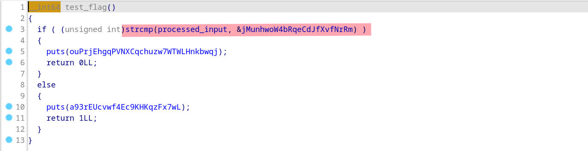
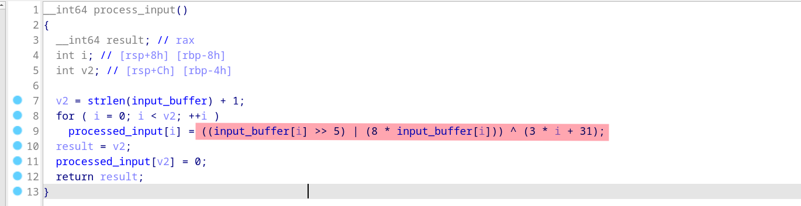

# Babyfuscation

# Reverse du code

Le programme demande le flag en entrée. 
Puis il effectue des modifications dans la fonction **process_input**
Pour finir, il compare l'entrée modifiée avec le flag offusqué.

Comparaison avec le flag :

# Fonction d'offuscation

La fonction d'offuscation **process_input** modifie les caractères de l'entrée utilisateur avec les opérations suivantes (en rouge) 

Voir le fichier **solve.py** pour l'inversion des opérations.

