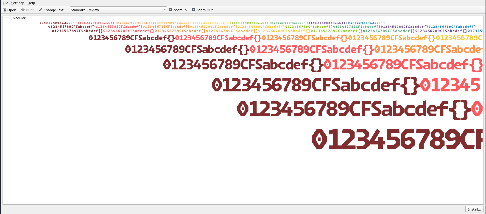
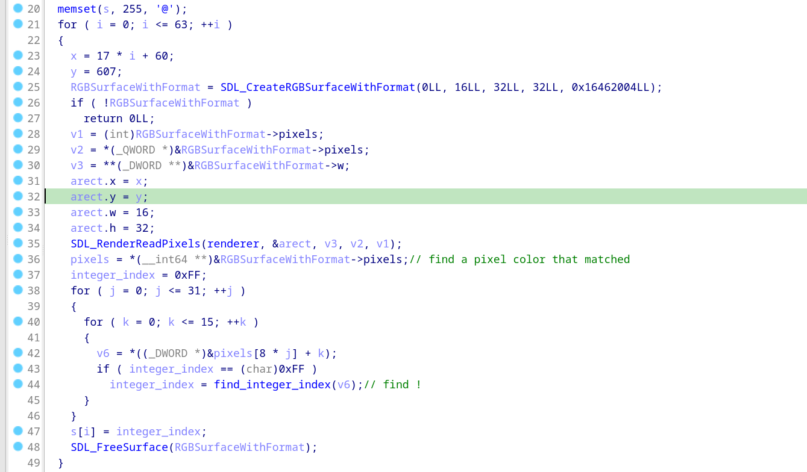
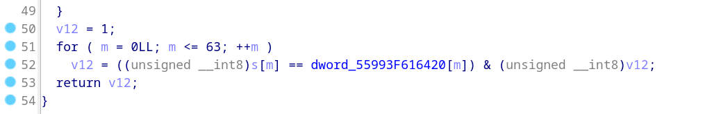
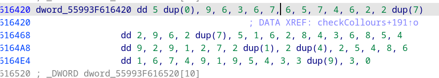

# Coloratops

Le binaire utilise la librarie graphique SDL pour afficher une fenêtre, gérer les entrées clavier, afficher des images et SURTOUT du texte.
Pour afficher du texte elle charge une police "FCSC" qui contient une définition et une couleur pour les caractères "012345789abcdef{}".

Il est important de noté que la couleur des caractères affichés dépend de la position du caractère, de sa valeur masi aussi de la couleur du caractère suivant !



## Recherche de la fonction de vérification

La fonction de vérification est **checkColours** et est appelée à chaque frame.


Elle "observe" les couleurs des caractères affichés et recherche l'index correspondant pour chaque caractère.



Puis, cette suite d'index est comparée avec la suite du flag.



La suite du flag dans la section **.rodata**.




## Récupération de la table de correspondance des couleurs

J'ai récupérer la table de correspondance des couleurs dynamiquement (breakpoint dans la fonction **checkColours**). La voici :

```
1 -> bordeaux
2 -> rouge
3 -> orange
4 -> orange clair
5 -> jaune
6 -> vert clair
7 -> vert sapin
8 -> mauve
9 -> bleu
```

## Stratégie 1

Afin d'éviter un long et fastidieux bruteforce, j'ai essayer de comprendre comment le programme attribué les couleurs aux caractères affichés. Il s'avère que le binaire est lié dynamiquement donc impossible qu'il s'agisse d'un modification dans la librairie SDL. 
Cepandant, n'ayant pas trouver le code correspondant dans le binaire (on ne sait jamais, un handle bien placé peut faire très mal) j'en ai déduit que c'est la librarie SDL qui est responsable de cela.

Yopaman, a réussi à trouver le flag de cette manière et le décrit très bien dans son writeup : https://github.com/Yopaman/CTF-writeups/blob/main/FCSC2025/reverse/coloratops.md

## Statégie 2 : Bruteforce

N'ayant pas trouver de doc sur l'attributation des couleurs avec SDL, j'ai récupérer le flag manuellement.
Pour ce faire, il faut reconstruire le flag en s'assurant que chaque caractère ait la couleur correspondante dans la suite.
Étant donné que la couleur dépend de celle du caractère précédant il faut effectuer le bruteforce depuis la fin de la chaîne.

Après, une bonne heure de plissements d'yeux (maudit soit la personne qui a choisi de mettre du **jaune**, **orange clair** et **orange** dans les couleurs possibles !) le flag a été correctement reconstruit.

#### Est ce qu'un daltonien à réussi ????


