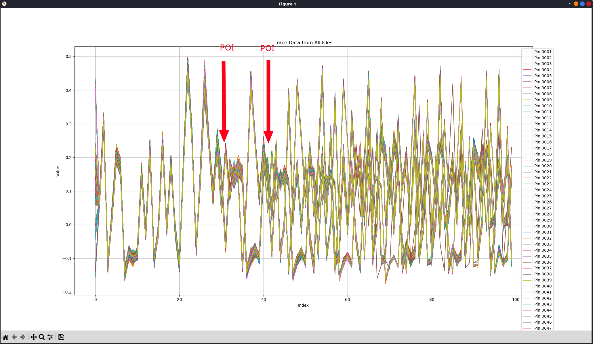
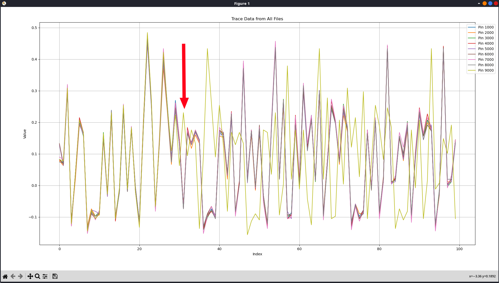

# CryptoBro

```
Pour retrouver le code PIN de mon portefeuille de cryptomonnaies super securisé qui contient 0.00000001 BTC, j'ai acheté un oscilloscope top niveau à 10,000 euros. Mais je ne sais pas bien quoi faire de toutes ces traces. Tu pourrais peut-être me filer un coup de main ?

J'ai réalisé une acquisition pour chaque PIN possible, mais pour éviter de déclencher un mécanisme de sécurité et donc l'effacement du portefeuille, je coupe l'alimentation au bout de quelques microsecondes après chaque tentative.

Note : L'archive cryptobro.tar.xz contient des fichiers nommés trace_XXXX.npy, où XXXX correspond au PIN utilisé pour générer la trace. Une fois le code PIN récupéré, il faut le placer entre FCSC{} pour obtenir le flag. Par exemple, si le code PIN trouvé était 1234, le flag serait FCSC{1234}.

Attention pour cette épreuve, vous ne disposez que de 10 essais. Une fois que vous aurez trouvé la bonne technique à utiliser, il n'y aura aucune ambiguïté pour retrouver un code PIN unique.
```

# Démarche

J'ai commencer par observer les traces avec **matplotlib**.

On remarque que certains groupes de traces sont désynchroniser à partir de certains points d'intérêts (POI). Le chaos augmente au fur et à mesure de l'exécution.



Si l'on affiche les traces pour les PINS [0000, 1000, 2000, 3000, 4000, 5000, 6000, 7000, 8000, 9000], on observe qu'à un certain POI la trace jaune diverge des autres. On peut en déduire que cette trace est la "bonne à suivre" psuique le premier caractère du code PIN est correcte : **9**




On répète l'observation pour les traces : [9000, 9100, 9200, 9300, 9400, 9500, 9600, 9700, 9800, 9900]

Et ainsi de suite. On retrouve le code PIN correcte : 9466

Voir : **solve.py**


